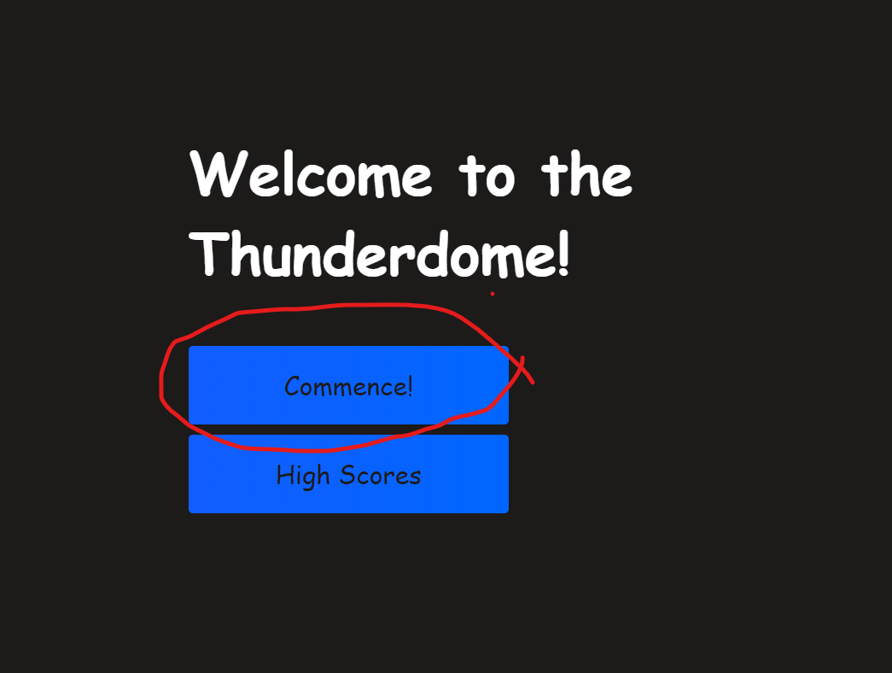

# Quiz-Sitch
A fun timed quiz for web development!

# Description

    -I've created this App to demonstrate my skills with creating a timed quiz and creating a data bass that records previous users names and their scores.

    -The repo was made to cycle through different pages with a timer during the game, and get a score to give a little feeling of competition and fun.

    -This has proven to be the most tiring and demanding of my challenges, but I feel all the better for having done it and learned a ton of new things along the way.

- [Installation](#installation)
- [Usage](#usage)
- [Credits](#credits)
- [License](#license)
- [Features](#features)
## Installation

1. Go to https://github.com/joshdelmonte/Quiz-Sitch.git and clone the repository.
    
2. Type the following command in git bash:

    ~"git clone (pasted url from git repository)"

3. Access your desktop downloads and it should be in recent your recent downloads.

4. Open in whatever code editor you are using (i.e. VS Code, Intellij Idea, etc.)
-Feel free to modify however you wish via Visual Studio or whatever GUI you prefer.

-Here is the link to the page if you'd like to observe as well:

"https://joshdelmonte.github.io/Quiz-Sitch/"

## Usage

-Simply click the button to start a series of questions to participate in a quiz. Once you've agreed and accumulate a score you may submit your name and see who has participated before you.

## Credits

-Credits go to The DU Bootcamp resources their instructors and assistants for all they have taught me. JavaScript is an amazing skill and I'm keen on honing it to the best of my abilities.
And to a Youtube channel called Brian Design. Greatly helped me set up the framework, and understand const and let to help me generate this app.
## License

MIT License

Copyright (c) [2022] [Joshua Delmonte]

Permission is hereby granted, free of charge, to any person obtaining a copy
of this software and associated documentation files (the "Software"), to deal
in the Software without restriction, including without limitation the rights
to use, copy, modify, merge, publish, distribute, sublicense, and/or sell
copies of the Software, and to permit persons to whom the Software is
furnished to do so, subject to the following conditions:

The above copyright notice and this permission notice shall be included in all
copies or substantial portions of the Software.

THE SOFTWARE IS PROVIDED "AS IS", WITHOUT WARRANTY OF ANY KIND, EXPRESS OR
IMPLIED, INCLUDING BUT NOT LIMITED TO THE WARRANTIES OF MERCHANTABILITY,
FITNESS FOR A PARTICULAR PURPOSE AND NONINFRINGEMENT. IN NO EVENT SHALL THE
AUTHORS OR COPYRIGHT HOLDERS BE LIABLE FOR ANY CLAIM, DAMAGES OR OTHER
LIABILITY, WHETHER IN AN ACTION OF CONTRACT, TORT OR OTHERWISE, ARISING FROM,
OUT OF OR IN CONNECTION WITH THE SOFTWARE OR THE USE OR OTHER DEALINGS IN THE
SOFTWARE.

---

## Features

-This quiz prompts users with a small array of random questions, and allows them to enter their name among the highscores that have participated in the past.

---

## URLS
-Deployed URL
"https://joshdelmonte.github.io/Quiz-Sitch/"

-Github URL
"https://github.com/joshdelmonte/Quiz-Sitch.git"

